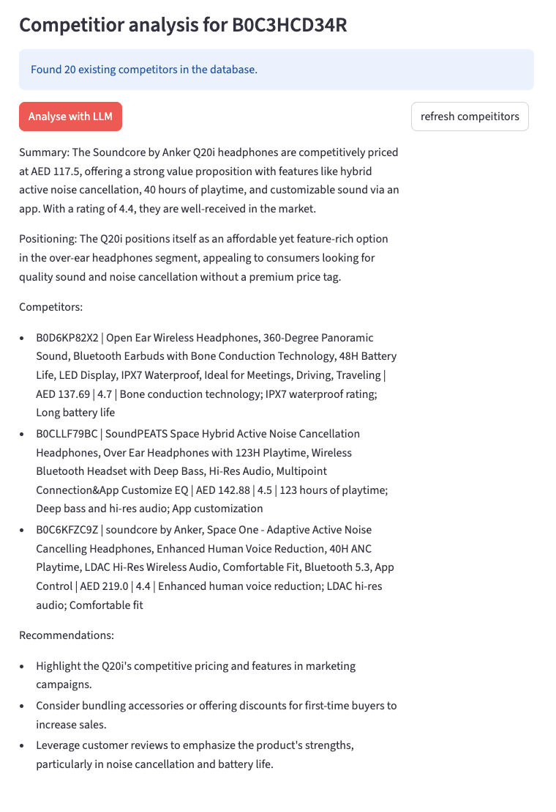
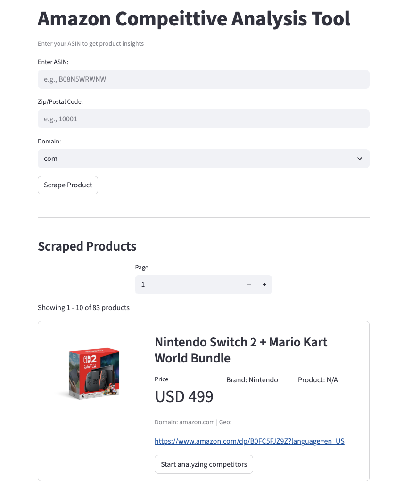

# PriceCompetitionAnalysis

A Python tool for analyzing products and their competitors on e-commerce platforms like Amazon. It scrapes product data, performs competitor analysis, and generates actionable insights using OpenAI GPT models. **We use Oxylabs to ethically scrape the data.**

---

## Features

- Fetch product details including title, price, currency, rating, and categories.
- Identify and format competitor products for comparison.
- Generate concise, AI-powered market analysis including:
  - Summary of the product’s positioning
  - Top competitors with key points
  - Strategic recommendations
- Support for multiple OpenAI models (`gpt-4o-mini`, `gpt-3.5-turbo`) for analysis.
- Designed with **pydantic** models for clean data validation and structured outputs.

---

## Project Structure

```
webscraperComparison/
├─ .env                # OpenAI API key
├─ main.py             # Entry point
├─ src/                # Source code
│  ├─ db.py            # Database interface
│  └─ llm.py           # AI analysis functions
├─ data.json           # Example data
├─ README.md
└─ requirements.txt
```

---

## Installation

1. **Clone the repository**

```bash
git clone https://github.com/yourusername/webscraperComparison.git
cd webscraperComparison
```

2. **Install dependencies**

```bash
python3 -m pip install --upgrade pip
python3 -m pip install -r requirements.txt
```

3. **Set up environment variables**

Create a `.env` file in the project root:

```
OPENAI_API_KEY=sk-your-openai-key
```

> Make sure there are **no quotes** around your API key.

---

## Usage

Run the main script:

```bash
python3 main.py
```

This will:

1. Load a product from the database.
2. Fetch competitor products.
3. Generate AI-powered analysis and recommendations.
4. Output a formatted report in the console.

---

## Configuring the AI Model

By default, the project uses OpenAI GPT models. If your key does not have access to `gpt-4`, you can use alternatives:

```python
from langchain_openai import ChatOpenAI

llm = ChatOpenAI(model="gpt-4o-mini", temperature=0)
# or
llm = ChatOpenAI(model="gpt-3.5-turbo", temperature=0)
```

---

## Dependencies

- Python 3.13+
- [python-dotenv](https://pypi.org/project/python-dotenv/)  
- [pydantic](https://pydantic-docs.helpmanual.io/)  
- [OpenAI](https://pypi.org/project/openai/)  
- [LangChain](https://pypi.org/project/langchain/)  

Install via `requirements.txt`.

---

## Notes

- Ensure your OpenAI key has access to the model you specify.  
- Keep your `.env` file secure — do **not** commit it to version control.  
- Designed to be modular: the AI analysis can be replaced with other LLMs if needed.

---
## Examples



